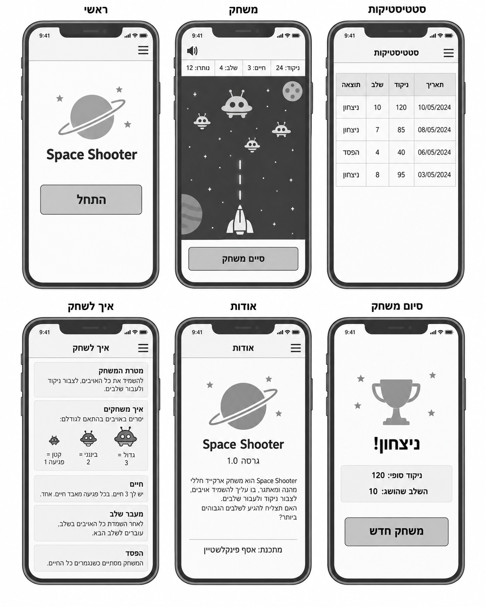
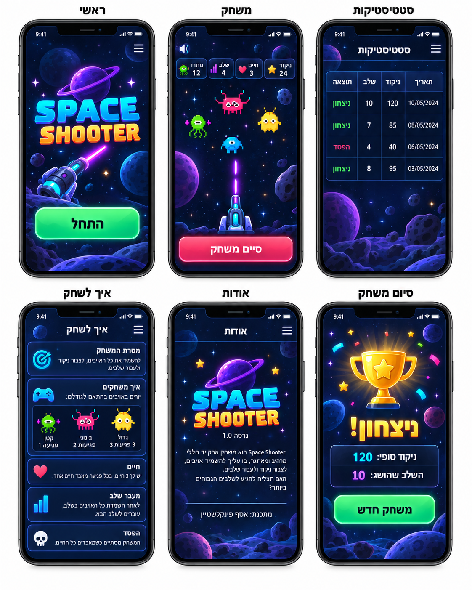
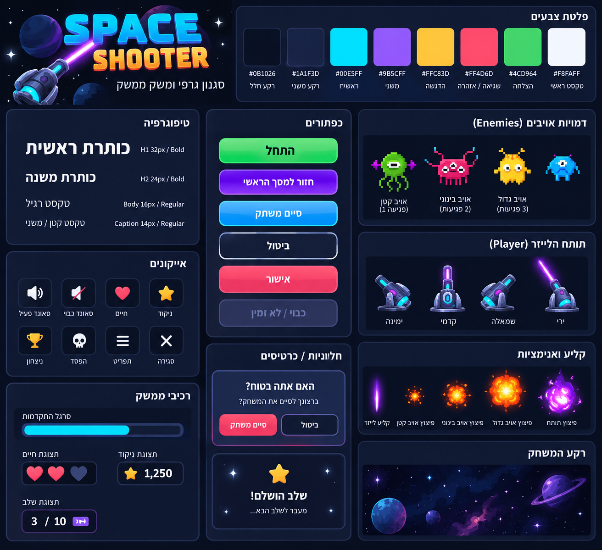

# Design (UI / UX)

> איך האפליקציה נראית ואיך המשתמשים נעים בתוכה. לקובץ זה שני חלקים:
> ה-**Screens** (מסכים) וה-**Style Guide**. תמונות הייחוס נמצאות באותה
> תיקיית `spec/`.

## חלק 1 — מסכים (Screens)

> תיאור המסכים מתייחס לגרסת Mobile של המשחק, בהתאם ל-Wireframes ול-Mockups.
> האפליקציה היא RTL ומותאמת למסך טלפון מודרני.

### Wireframes (מבנה ופריסה)


### המראה הסופי (Mockups)


### רשימת המסכים

#### מסך ראשי
- **מטרה:** לאפשר למשתמש להיכנס למשחק ולהתחיל משחק חדש.
- **מה יש בו:** לוגו Space Shooter, שם המשחק, רקע חלל, כפתור גדול "התחל", אייקון תפריט Hamburger ואייקון Sound.
- **מה קורה:** לחיצה על "התחל" פותחת מיד משחק חדש בשלב 1. תפריט ה-Hamburger מאפשר מעבר ל"ראשי", "סטטיסטיקות", "איך לשחק" ו"אודות". אייקון ה-Sound משתיק או מפעיל את כל האודיו באפליקציה.

#### מסך משחק
- **מטרה:** לאפשר למשתמש לשחק בפועל, לירות באויבים, לצבור ניקוד ולעבור שלבים.
- **מה יש בו:** אזור משחק מרכזי, תותח לייזר בתחתית המסך, אויבים המופיעים מלמעלה, קליעי לייזר, רקע חלל סטטי, HUD עם ניקוד, חיים, שלב ואויבים שנותרו, אייקון Sound וכפתור "סיים משחק".
- **מה קורה:** לחיצה או נגיעה בנקודה במסך מסובבת את התותח לכיוון הנקודה ויורה קליע אחד. פגיעה באויב מורידה לו חיים בהתאם לגודלו. אויב שחוסל מתפוצץ ומוסיף ניקוד. כאשר כל אויבי השלב חוסלו מוצגת הודעת "שלב X הושלם" והמשחק עובר אוטומטית לשלב הבא. פגיעה של אויב בתותח מורידה חיים ומפעילה מחדש את אותו שלב. לחיצה על "סיים משחק" פותחת Dialog לאישור; אישור מחזיר למסך הראשי ללא שמירת המשחק בסטטיסטיקות. בזמן משחק פעיל הניווט למסכים אחרים חסום.

#### מסך סטטיסטיקות
- **מטרה:** לאפשר למשתמש לצפות בתוצאות של משחקים קודמים.
- **מה יש בו:** כותרת "סטטיסטיקות", תפריט Hamburger, טבלה עם העמודות תאריך, ניקוד, שלב ותוצאה.
- **מה קורה:** הנתונים נטענים מ-`localStorage`. המשחק האחרון מופיע ראשון. המסך הוא לצפייה בלבד ואין אפשרות למחוק או לערוך נתונים. אם אין משחקים קודמים מוצגת ההודעה "עדיין אין משחקים קודמים להצגה".

#### מסך איך לשחק
- **מטרה:** להסביר לילדים בצורה קצרה וברורה את חוקי המשחק.
- **מה יש בו:** כותרת "איך לשחק", תפריט Hamburger, אזורים קצרים עבור מטרת המשחק, אופן הירי, שלושת גדלי האויבים, מספר החיים, מעבר שלב ותנאי הפסד.
- **מה קורה:** המסך אינו אינטראקטיבי פרט לניווט. המשתמש קורא את ההוראות ויכול לעבור למסך אחר דרך התפריט.

#### מסך אודות
- **מטרה:** להציג מידע קצר על המשחק ועל היוצר.
- **מה יש בו:** כותרת "אודות", לוגו Space Shooter, גרסה 1.0, טקסט קצר על המשחק וקרדיט "מתכנת: אסף פינקלשטיין".
- **מה קורה:** המסך מיועד לקריאה בלבד. המעבר למסכים אחרים מתבצע דרך תפריט ה-Hamburger.

#### מסך סיום משחק
- **מטרה:** להציג למשתמש את תוצאת המשחק ולאפשר להתחיל משחק חדש.
- **מה יש בו:** המחשה ברורה של ניצחון או הפסד, ניקוד סופי, השלב שאליו הגיע המשתמש וכפתור "משחק חדש".
- **מה קורה:** אם המשתמש השלים את שלב 10 בתוך שלושת החיים מוצגת הודעת ניצחון. אם איבד את כל שלושת החיים מוצגת הודעת הפסד. לחיצה על "משחק חדש" מתחילה משחק חדש משלב 1, עם 3 חיים וניקוד 0.

### ניווט (איך המסכים מתחברים)

```text
מסך ראשי
   ├── התחל ───────────────> מסך משחק
   ├── סטטיסטיקות ─────────> מסך סטטיסטיקות
   ├── איך לשחק ───────────> מסך איך לשחק
   └── אודות ──────────────> מסך אודות

מסך משחק
   ├── ניצחון / הפסד ──────> מסך סיום משחק
   └── סיים משחק + אישור ──> מסך ראשי

מסך סיום משחק
   └── משחק חדש ───────────> מסך משחק
```

> במסכים שאינם משחק פעיל ניתן לעבור בין "ראשי", "סטטיסטיקות", "איך לשחק" ו"אודות" דרך תפריט ה-Hamburger.
> בזמן משחק פעיל הניווט למסכים אחרים חסום.

---

## חלק 2 — Style Guide



### צבעים (Colors)

| תפקיד | צבע (hex) |
|-------|-----------|
| Primary (כפתורים ראשיים, קישורים) | `#00E5FF` |
| רקע (Background) | `#0B1026` |
| רקע משני / Panels | `#1A1F3D` |
| טקסט (Text) | `#F8FAFF` |
| Accent סגול | `#9B5CFF` |
| Accent צהוב / ניקוד | `#FFC83D` |
| שגיאה / סכנה / כפתור סיום | `#FF4D6D` |
| הצלחה / התחלה | `#4CD964` |

### גופנים (Fonts)

- **כותרות:** `Rubik`, משקל Bold / 700
- **טקסט גוף:** `Rubik`, משקל Regular / 400
- **Fallback:** `Arial`, `sans-serif`

גדלים מומלצים:
- `H1`: כ-32px
- `H2`: כ-24px
- `Body`: כ-16px
- `Caption`: כ-14px

### מראה ותחושה

- **פינות:** מעוגלות מאוד, בעיקר בכפתורים, Cards ו-Dialogs.
- **אווירה כללית:** משחק חלל צבעוני, שובב, זוהר וידידותי לילדים, עם תחושת Arcade / Sci-Fi.
- **רקע:** כחול-שחור עמוק עם כוכבים, כוכבי לכת ואסטרואידים.
- **אויבים:** יצורי חלל מצחיקים וצבעוניים בסגנון Pixel Art.
- **תותח:** תותח לייזר עתידני עם Glow בגווני סגול, כחול וטורקיז.
- **ירי:** קליע לייזר זוהר, בעיקר בגווני סגול/ורוד.
- **פיצוצים:** אנימציות בהירות ובולטות בגווני כתום, צהוב וסגול.
- **כפתורים:** גדולים וברורים, עם Gradient עדין, Glow ו-Contrast גבוה.
- **Cards / Panels:** רקע כחול כהה, Border כחול/סגול עדין וצל פנימי/חיצוני קל.
- **אייקונים:** פשוטים, גדולים וברורים; לדוגמה Sound, Lives, Score, Menu, Win ו-Loss.
- **HUD:** קומפקטי אך קריא, עם מספרים בולטים ואייקונים צבעוניים.
- **טקסט:** קצר וברור, עם מעט טקסט בכל מסך.
- **RTL:** כל רכיבי ה-UI, הכותרות, הטבלאות והטקסטים מוצגים מימין לשמאל.

### עקרונות UX מרכזיים

- כל פעולה עיקרית צריכה להיות ברורה במבט ראשון.
- כפתורים חשובים צריכים להיות גדולים ונוחים למגע.
- אין להעמיס טקסט או פעולות משניות.
- משוב חזותי וקולי ניתן מיד לאחר ירי, פגיעה, חיסול, איבוד חיים ומעבר שלב.
- אין להשתמש בתפריטים מורכבים.
- המשתמש תמיד צריך לראות במהלך משחק את הניקוד, החיים, השלב ומספר האויבים שנותרו.
- במובייל יש לשמור על Touch Targets נוחים ועל מרווחים מספקים בין פעולות.
